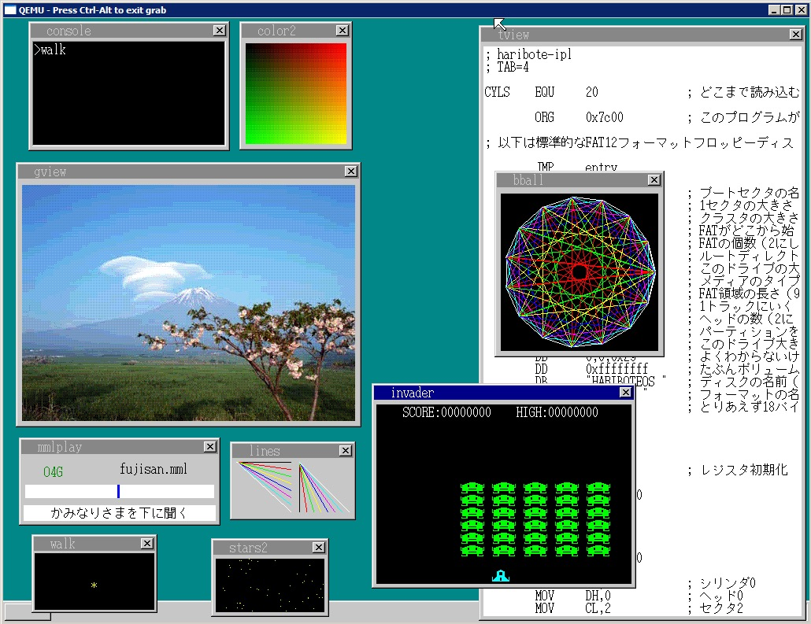

#《30天自制操作系统》中文源码 —— OSASK

自己制作一个操作系统的过程，阅读过程会一边汉化源码，一边执行还有根据一些相关的内容进行代码的书写，欢迎大家交流。

运行方法，在 `tolset` 中新建一个 `run` 文件夹，把代码拷贝进去，然后根据系统版本运行 `!cons_**.bat`。

一般都是使用 `make run` 运行代码，27天开始使用 `make run_full`。可以直接看书。

## 完成效果

## 内容简介

### 第一周（第1天～第7天）

一开始首先要考虑怎么来写一个“只要一通电就能运行的程序”。这部分用C语言写起来有些困难，所以主要还是用汇编语言来写。

这步完成之后，下一步就要写一个从磁盘读取操作系统的程序。这时即便打开电脑电源，它也不会自动地将操作系统全部都读进来，它只能读取磁盘上最开始的512字节的内容，所以我们要编写剩余部分的载入程序。这个程序也要用汇编语言编写。

一旦完成了这一步，以后的程序就可以用C语言来编写了。我们就尽快使用C语言来学习开发显示画面的程序。同时，我们也能慢慢熟悉C语言语法。这个时候我们好像在做自己想做的事，但事实上我们还没有自由操纵C语言。

接下来，为了实现“移动鼠标”这一雄心，我们要对CPU进行细致的设定，并掌握中断处理程序的写法。从全书总体看来，这一部分是水平相当高的部分，笔者也觉得放在这里有些不妥，但从本书条理上讲，这些内容必须放在这里，所以只好请大家忍耐一下了。在这里，CPU的规格以及电脑复杂的规格都会给我们带来各种各样的麻烦。而且开发语言既有C语言，又有汇编语言，这又给我们造成了更大的混乱。这个时候我们一点儿也不会觉得这是在做自己想做的事，怎么看都像是在“受人摆布”。

渡过这个痛苦的时期，第一周就该结束了。

### 第二周（第8天～第14天）

一周的苦战还是很有意义的，回头一看，我们就会发现自己还是斩获颇丰的。这时我们已经基本掌握了C语言的语法，连汇编语言的水平也能达到本书的要求了。

所以现在我们就可以着手开发像样的操作系统了。但是这一次我们又要为算法头痛了。即使掌握了编程语言的语法，如果不懂得好的算法的话，也还是不能开发出来自己想要的操作系统。

所以这一周我们就边学习算法边慢慢地开发操作系统。不过到了这一阶段，我们就能感觉到基本上不会再受技术问题限制了。

### 第三周（第15天～第21天）

现在我们的技术已经相当厉害了，可以随心所欲地开发自己的操作系统了。首先是要支持多任务，然后是开发命令行窗口，之后就可以着手开发应用程序了。

到本周结束时，就算还不够完备，我们也能拿出一个可以称之为操作系统的软件了。

### 第四周（第22天～第28天）

在这个阶段，我们可以尽情地给操作系统增加各种各样的功能，同时还可以开发出大量像模像样的应用程序来。

这个阶段我们已经能做得很好了，这可能也是我们最高兴的时期。这部分要讲解的内容很少，笔者也不用再煞费苦心地去写那些文字说明了，可以把精力都集中在编程上（笑）。

对了，说起文字才想起来，正好在这个时期可以让我们的操作系统显示文字了。

### 免费赠送两天（第29天～第30天）

剩下的两天用来润色加工。这两天我们来做一些之前没来得及做，但做起来既简单又有趣的内容。

